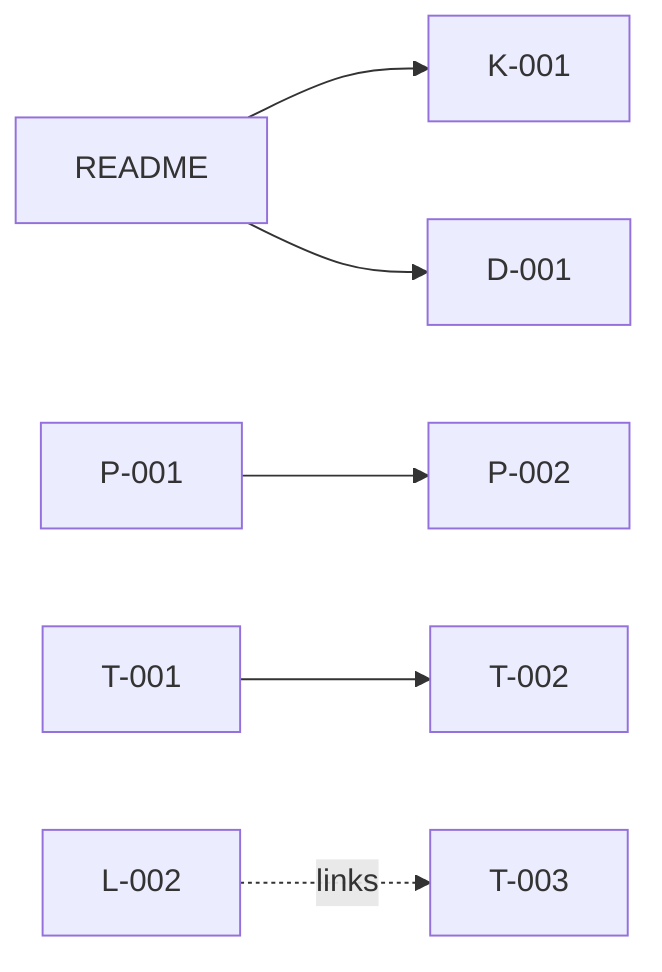

# Neural Memory Layer for Rafique Estudio

## Purpose

Master Neural Memory Layer for cross-IDE AI context.

## Neuron Registry

| ID    | Title                        | Importance | Status    |
| ----- | ---------------------------- | ---------- | --------- |
| K-001 | Core Project Identity        | 10         | confirmed |
| K-002 | Portfolio Context            | 8          | confirmed |
| R-001 | Client Psychology            | 7          | confirmed |
| R-002 | Competitive Landscape        | 6          | confirmed |
| X-001 | Security Risks               | 9          | confirmed |
| X-002 | Compliance Risks             | 7          | confirmed |
| T-001 | System Architecture          | 10         | confirmed |
| T-002 | Core Features Matrix         | 8          | confirmed |
| T-003 | Critical Operations Protocol | 9          | confirmed |
| D-001 | Active Decisions             | 10         | confirmed |
| D-002 | Tradeoffs Archive            | 6          | confirmed |
| L-001 | Telemetry & Feedback         | 5          | confirmed |
| L-002 | Mistakes & Regressions       | 10         | confirmed |
| P-001 | PRD                          | 9          | confirmed |
| P-002 | Functional Specs             | 8          | confirmed |
| P-003 | Milestone Roadmap            | 6          | confirmed |

## Tag Index

- **foundation**: K-001, K-002
- **research**: R-001, R-002
- **risk**: X-001, X-002
- **tech**: T-001, T-002, T-003
- **decisions**: D-001, D-002
- **learnings**: L-001, L-002
- **prd**: P-001, P-002, P-003

## Knowledge Graph

## Agent Startup Sequence

1. Read README.md
2. Consult K-001, D-001
3. Retrieve task-relevant neurons by tag.
